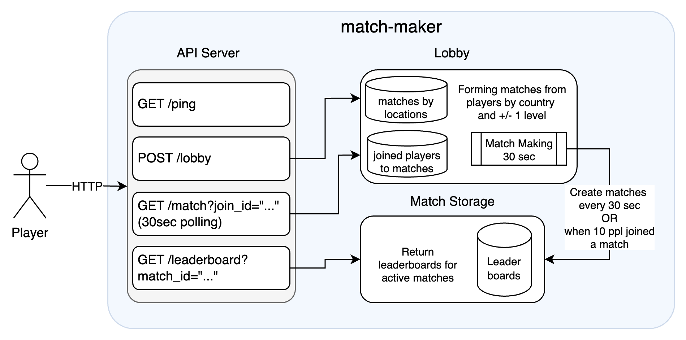

# Match Maker

Match Maker is a service designed to manage player lobbies and match players based on certain criteria. This service provides APIs to join lobbies and create matches. Once the expected number of players have joined (or 30 seconds of waiting has passed), the match creates. I also assume that
- players can have any name so I do not validate player_id uniqueness (could be implemented in the future)
- players can have a level from 1 to 99
- for matchmaking, players are combined with +1/-1 level from theirs, for example:
  - a player with Level 4 could be placed with players of Level 3 and Level 5
  - **note** that a player with Level 1 will be placed with players of Level 1 or Level 2 or Level 3
- matches with only 1 player do not start, but player is notified and asked to join the lobby again
- players are grouped into matches by countries first, and then by their similar levels. Note, that I implemented grouping only by 1 country. Grouping by nearest countries could also be implemented later.
- /leaderboard (see detailed API below) returns players with `score: 0`. I assumed the score would change as the match goes

## Table of Contents

- [Structure](#structure)
- [Installation](#installation)
- [Usage](#usage)
- [API Endpoints](#api-endpoints)
- [Configuration](#configuration)
- [Running Tests](#running-tests)
- [Use of AI tools](#use-of-ai-tools)
- [Additional notes](#additional-notes)

## Structure

The project structure is shown in the diagram below:



## Installation
To install the Match Maker service, clone the repository and build the project:

```bash
git clone git@github.com:TanyEm/match-maker.git
cd match-maker
make build
```

## Usage

To run the Match Maker service, use the following command:

```bash
./bin/match-maker
```

## API Endpoints

### View Full API Documentation in Swagger Editor
1. Open [Swagger Editor](https://editor.swagger.io/).
2. Upload the `swagger.json` file by selecting the "File" menu, then "Import file."
3. The Swagger Editor will display the API documentation for you to interact with.

`GET /ping`

Health check endpoint to verify the service is running.

Response:

```json
{
  "message": "pong"
}
```

`POST /lobby`

Join a lobby with player details.

Request:

```json
{
  "player_id": "player1",
  "level": 1,
  "country": "USA"
}
```

Response:

```json
{
  "join_id": "00000000-0000-0000-0000-000000000000"
}
```

`GET /match`

Check a match for a player in the lobby. **Note**, this is supposed to be a polling-request from client side, meaning wait at most 30 seconds (default MATCH_MAKING_TIME configured on the server side). The client may also have lower timeouts and retry the request until the result is provided.

Request:

```bash
GET /match?join_id=00000000-0000-0000-0000-000000000000
```

Response:

```json
{
  "match_id": "00000000-0000-0000-0000-000000000000"
}
```

In case the match for a player, e.g. there was only 1 player joining the match, a **404** Response is returned:
```json
{
	"error": "no match for the player, try to join the lobby again"
}
```

`GET /leaderboard`

Get leaderboard by match_id.

Request:

```bash
GET /leaderboard?match_id=00000000-0000-0000-0000-000000000000
```

Response:

```json
{
	"match_id": "00000000-0000-0000-0000-000000000000",
	"players": [
		{
			"player_id": "123",
			"level": 4,
			"country": "FIN",
			"score": 0
		},
		{
			"player_id": "1234",
			"level": 4,
			"country": "FIN",
			"score": 0
		}
	]
}
```

## Configuration

The service can be configured using environment variables:

 - PORT: The port on which the service will run (default: 8080).
 - SHUTDOWN_DURATION: The duration to wait before shutting down the service (default: 3s).
 - MATCH_MAKING_TIME: The duration time for match making players in lobby (default: 30s)

## Running Tests

To run the tests for the Match Maker service, use the following command:

```bash
make test
```

If there are issues with mocks, ensure that [gomock](https://github.com/uber-go/mock) `mockgen` is installed:

```bash
go install go.uber.org/mock/mockgen@latest
export PATH=$PATH:$(go env GOPATH)/bin
mockgen -version
```

## Use of AI tools

During the development I used GitHub Copilot for:

 - Faster code writing and auto completion
 - FAQ for how to do certain things in Go like channels, table tests, 30 second polling using context, graceful shutdown and so on

## Additional notes

 - Added Makefile for simpler usage of basic Go commands
 - I looked for project structure from best examples like [Go Project Layout](https://github.com/golang-standards/project-layout) and [Kubernetes repo](https://github.com/kubernetes/kubernetes) etc to
    - put executables like main.go in cmd/match-maker
    - have service logic organized in /internal packages
    - have test utils available at the root project
 - Studied Go Tour and the Effective Go a bit and tried to follow the "Go Way"
 - Used [Gin HTTP framework](https://github.com/gin-gonic/gin/tree/master) and its [docs](https://github.com/gin-gonic/gin/blob/master/docs/doc.md) to implement the router and validators
 - Made all data storages in-memory to save time. In real project I would look into more persistent options like Redis for Lobby data or Postgres or Mongo for matches data for example.
 - Could not complete all tests due to time limitations but believe it is a **must** to complete them for a real project, especially for Lobby logic
